# 融合特征匹配与异常行为分析的网络攻击检测系统 — 总体设计报告

| 项目名称 | 融合特征匹配与异常行为分析的网络攻击检测系统 |
|---|---|
| 姓名 | 韩宇飞（组长）、李哲、曾子恒、陈志恒、姜新晨 |
| 学号 | 524031910172 / 524031910017 / 523010910022 / 524031910111 / 524031910769 |
| 学院 | 计算机学院 |
| 指导教师 | 陈秀真，姚立红 |
| 日期 | 2026年7月17日 |

---

## 一、系统需求分析

### 1.1 安全需求

本系统面向小型网络环境（如实验室局域网、校内子网段），需解决以下四类安全检测问题：

**1. 已知 Web 攻击识别**

网络中存在大量具有固定特征的攻击行为，如 SQL 注入（`UNION SELECT`、`' OR 1=1`）、跨站脚本 XSS（`<script>` 标签注入）、恶意系统命令执行（`/bin/cat /etc/passwd`）等。这些攻击以 HTTP 请求为载体，传统包过滤防火墙工作在网络层/传输层，无法检测应用层载荷中的恶意特征。系统需内置一个可维护、可扩展的攻击特征库，对实时流量的应用层 payload 进行多模式匹配，且支持字面匹配（literal）和正则表达式匹配（regex）两种模式。

**2. 暴力破解行为发现**

面向 SSH（22端口）、FTP（21端口）、数据库（3306、5432、6379端口）、Web 登录（8080、8443端口）等认证服务的暴力密码枚举攻击极为常见。攻击者在短时间内以极高频率发起连接尝试，表现为同一源 IP 在几十秒内对同一目标登录端口发起数十次 TCP SYN。系统需基于时间窗口的滑动密度统计自动发现此类行为，并结合服务端 RST 拒绝响应的次数佐证认证失败。

**3. 网络扫描与横向扩散识别**

攻击者在渗透阶段通常在信息搜集后进行端口扫描（发现开放服务）和内网横向移动（跳板攻击）。端口扫描表现为单一源 IP 在短时间内访问大量不同目标端口（24端口以上/60秒），横向扩散表现为单台内网主机在数分钟内访问多个不同内网 IP。系统需建立正常流量行为基线，识别上述显著偏离的探测行为。

**4. 异常外联与 C2 通信检测**

受控主机（僵尸节点）可能向外部 C2 服务器发起隐蔽通信。这类连接在正常业务流量中不常见——内网主机通常不主动访问陌生公网 IP。系统需维护内网 IP 段白名单，识别内网主机向不在白名单中的公网 IP 发起的出站连接。

### 1.2 具体功能要求

系统按功能分解为五个模块，对应五位成员分工开发：

| 编号 | 模块名称 | 负责人 | 核心功能 |
|---|---|---|---|
| M1 | 数据包捕获与协议解析 | 李哲 | 实时/离线抓包、IP/TCP/UDP/ICMP/ARP协议字段解析、TCP五元组流重组、应用层payload提取、TLS流量基础识别 |
| M2 | 特征行为检测引擎 | 曾子恒 | 攻击特征库（6字段格式）加载、字面匹配(literal)/正则匹配(regex)双模式、同源同类命中60秒窗口聚合、告警产出 |
| M3 | 暴力破解检测模块 | 陈志恒 | 连接尝试收集（SYN优先+退化flow_id计数）、双指针滑动窗口密度统计、RST拒绝佐证、端口→服务名映射、两级严重度判定 |
| M4 | 异常行为检测模块 | 姜新晨 | 端口扫描检测（同源端口多样性统计）、异常外联检测（内网IP白名单匹配）、基线阈值JSON可配置 |
| M5 | 告警汇总与监控GUI | 韩宇飞 | 多源告警合并/排序/去重、攻击行为关联（同源+同类+时间窗口→behavior_id）、三页签GUI面板（告警监控+特征库管理+统计概览）、全链路调用入口main.py |

各模块通过统一的 JSON 接口（报文记录格式 + 告警记录格式）松耦合通信。Phase1~3阶段所有检测模块的输入统一来自 `mock_data/mock_packets.json`（108条覆盖7类场景的模拟报文），Phase4起替换为真实抓包输出。

### 1.3 开发平台要求

| 项目 | 选型 | 选型理由 |
|---|---|---|
| 开发语言 | Python ≥ 3.9 | 生态丰富，scapy/pytest/tkinter均为标准或主流库，全员熟悉 |
| 抓包库 | scapy ≥ 2.5.0 | Python原生，支持实时抓包与pcap离线解析，无需安装系统级依赖 |
| GUI框架 | tkinter（Python标准库） | 零额外依赖，任何Python环境可直接运行；ttk主题化组件外观现代 |
| 测试框架 | pytest ≥ 7.0 | 简洁的断言语法，fixture机制支持mock数据复用 |
| 版本控制 | Git + GitHub（GitHub Flow） | 每人独立feature分支，PR → Code Review → 合并main |
| 代码格式化 | black + isort（推荐） | 统一代码风格，减少合并冲突 |
| AI辅助 | Claude Code / Cursor / Trae / 通义灵码 | 提升开发效率，尤其在字符串匹配算法实现和测试用例生成方面 |

### 1.4 运行环境要求

**软件环境**：
- 操作系统：Linux（推荐 Ubuntu 22.04 LTS）或 Windows 10/11 + WSL2
- Python 3.9 及以上版本
- pip 依赖：`scapy>=2.5.0`, `pytest>=7.0.0`
- 实时抓包场景需安装 Npcap（Windows）或 libpcap（Linux）

**硬件环境**：
- 普通 PC 或笔记本，CPU 双核及以上，内存 ≥ 4GB
- 网卡支持混杂模式（Promiscuous Mode），用于实时抓包
- 若在虚拟机中运行，需将网络适配器配置为桥接模式

**权限要求**：
- 实时抓包需 root 权限（Linux）或管理员权限（Windows）
- 仅读取 pcap 文件则无需提权

---

## 二、计划进度安排

项目自 2026年7月8日启动，至 8月5日最终提交，共四周。

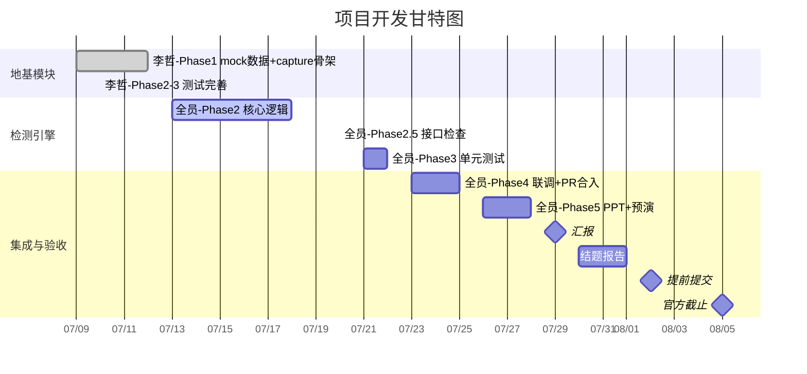

| 日期 | 里程碑 | 状态 |
|---|---|---|
| 7/9(四) ~ 7/12(日) | 李哲交付 mock 数据(108条) + capture 模块 | ✅ 已完成 |
| 7/13(一) ~ 7/18(六) | 四人完成核心检测逻辑 | 🔄 进行中（陈志恒、韩宇飞已完成合入；曾子恒、姜新晨开发中） |
| 7/20(一) | 接口对齐检查：aggregator校验各模块告警格式 | ⬜ 待进行 |
| 7/21(二) ~ 7/22(三) | 单元测试编写 + 异常处理补充 | ⬜ 待进行 |
| 7/23(四) ~ 7/25(六) | 全链路联调（真实抓包替换mock）+ PR合入main | ⬜ 待进行 |
| 7/26(日) ~ 7/28(二) | PPT制作 + 演示数据准备 + 内部预演 | ⬜ 待进行 |
| **7/29(三)** | ★ 课堂项目分享汇报 | ⬜ 待进行 |
| 7/30(四) ~ 8/1(六) | 结题报告撰写 + 源码最终整理 | ⬜ 待进行 |
| **8/2(日)** | 🏁 提前提交（比8/5截止早3天，留缓冲） | ⬜ 待进行 |
| 8/3(一) ~ 8/4(二) | 缓冲时间，应对突发问题 | ⬜ 待进行 |
| **8/5(三)** | 📅 官方结题截止 | ⬜ 待进行 |

---

## 三、系统总体架构

### 3.1 平台架构

系统采用自底向上的四层分层架构：数据捕获层 → 检测引擎层 → 汇总关联层 → 展示层。各层之间通过统一的JSON数据格式解耦。

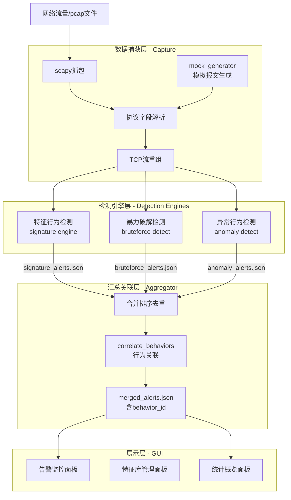

**各层职责**：

| 层级 | 职责 | 产出 |
|---|---|---|
| L1 数据捕获层 | 从网卡或pcap文件获取原始报文，解析为标准化记录，完成TCP流重组 | `Packet Record[]` |
| L2 检测引擎层 | 三个引擎并行消费同一份报文数据，各自从不同维度检测攻击行为 | `Alert Record[]`（按模块输出） |
| L3 汇总关联层 | 合并多源告警，按攻击行为进行跨模块关联，赋予统一的behavior_id | `merged_alerts.json` |
| L4 展示层 | 以攻击行为为粒度展示告警，提供筛选/搜索/统计/特征库管理功能 | GUI窗口 |

### 3.2 功能架构与数据流

系统核心数据流为：**数据包捕获 → TCP重组/协议识别 → 并行检测（特征行为检测 ∥ 暴力破解检测 ∥ 异常行为检测）→ 行为告警关联与汇总 → 监控GUI**。

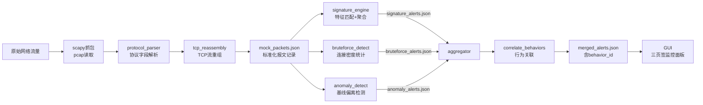

**关键设计决策**：

1. **并行检测架构**：三个检测引擎独立运行，彼此不依赖对方的输出。这允许任一引擎单独测试和部署，也允许未来增加新的检测引擎而不影响现有模块。

2. **统一的 JSON 接口**：所有模块通过两个标准 JSON Schema（Packet Record 和 Alert Record）通信。模块间不直接导入彼此的 Python 代码，仅通过 JSON 文件交换数据。这保证了即使独立开发者使用不同的代码风格或第三方库，也不会产生依赖冲突。

3. **行为聚合而非逐包告警**：无论是特征匹配、暴力破解还是异常检测，最终产出都以"攻击行为事件"为粒度。特征引擎对同源同类命中做窗口聚合，暴力破解按（src_ip, dst_ip, dst_port）分组，异常检测以偏离行为为单位。这使得GUI展示的告警数量可控、可读，避免告警洪流。

4. **CLI + 全链路两种运行模式**：每个检测模块提供独立的 `python -m` CLI入口（`--input` / `--output`），便于单模块调试；同时 `main.py` 提供一键运行全链路的入口（`python main.py --input mock_data/mock_packets.json`），用于集成测试和演示。

---

## 四、系统功能模块一：数据捕获与协议解析（李哲）

### 4.1 模块结构与调用关系

```
src/capture/
├── __init__.py              # 模块导出：capture_live, read_pcap, parse_packet, build_flow_id, reassemble
├── packet_capture.py        # 抓包入口：实时capture_live() / 离线read_pcap() / 持久化save_packets()
├── protocol_parser.py       # 协议解析核心：parse_packet(), build_flow_id(), encode_payload(), is_tls_traffic(), infer_direction()
├── tcp_reassembly.py        # TCP流重组：reassemble() 按五元组合并同流payload
└── mock_generator.py        # Mock数据生成器：generate_mock_packets() 可复现的108条测试报文
```

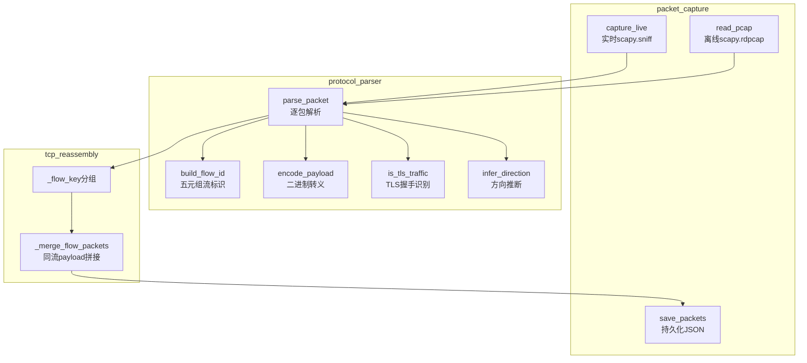

### 4.2 报文捕获子模块（packet_capture.py）

**实时抓包** `capture_live(interface, count, timeout, do_reassemble)`：
- 底层调用 `scapy.all.sniff(iface=interface, count=count, timeout=timeout)` 从指定网卡捕获原始报文
- `count=0` 时表示不限数量，由 `timeout` 参数控制抓包时长
- 捕获完成后逐包调用 `parse_packet()` 解析，可选调用 `reassemble()` 进行TCP重组
- scapy 未安装时打印 ERROR 日志并返回空列表，不崩溃

**离线读取** `read_pcap(filepath, do_reassemble)`：
- 调用 `scapy.all.rdpcap(filepath)` 读取 pcap/pcapng 文件
- 文件不存在时打印 WARNING 日志并返回空列表
- 其余处理流程同实时抓包

**CLI入口**：
```bash
# 离线模式
python -m src.capture.packet_capture --pcap capture.pcap --output results/captured_packets.json
# 实时模式
python -m src.capture.packet_capture --live --interface eth0 --count 100 --timeout 30
# 跳过TCP重组
python -m src.capture.packet_capture --pcap capture.pcap --no-reassemble
```

### 4.3 协议解析与流重组子模块（protocol_parser.py + tcp_reassembly.py）

**`parse_packet(raw_packet)` — 协议栈解析**：

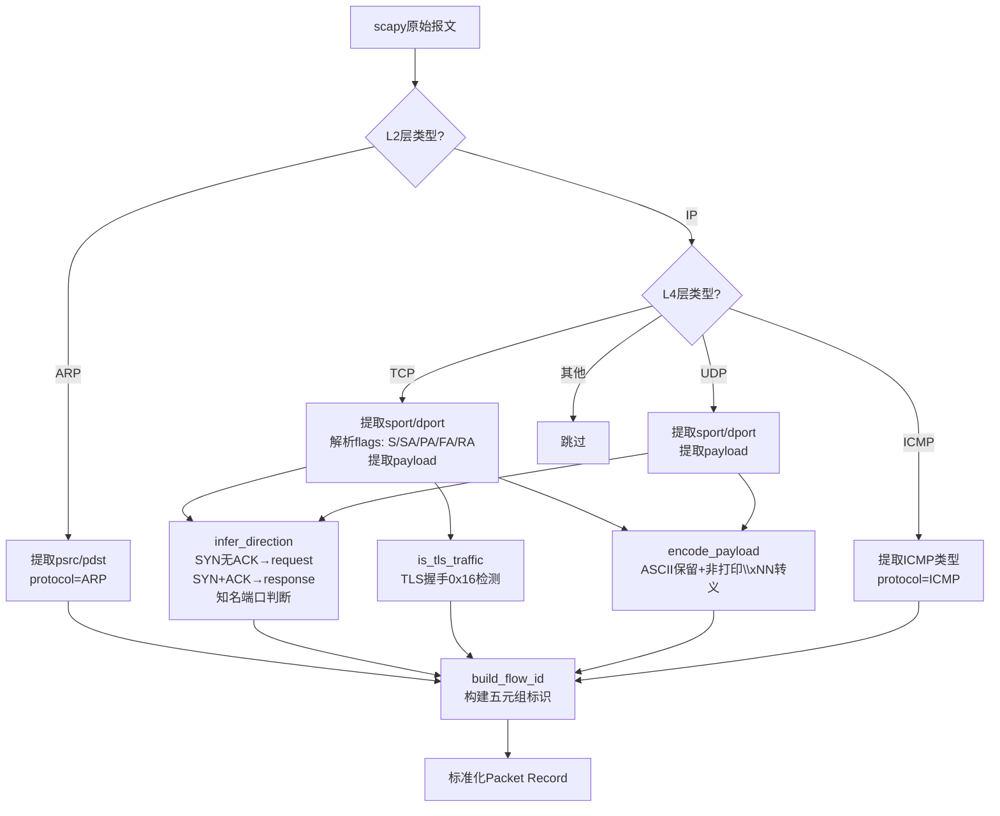

**关键字段解析规则**：
- `timestamp`：从 scapy 报文的 `.time` 属性提取，格式化为 ISO8601 毫秒精度（`YYYY-MM-DDTHH:MM:SS.mmm`）
- `flow_id`：`{src_ip}:{src_port}->{dst_ip}:{dst_port}/{protocol}`
- `direction`：优先通过TCP flags判断（SYN且无ACK→request，SYN+ACK→response），其次通过知名服务端口列表（SERVER_PORTS）判断
- `flags`：将 scapy 的 TCP flag 位映射为紧凑字符串（FIN→F, SYN→S, RST→R, PSH→P, ACK→A, URG→U）
- `payload`：`encode_payload()` 将原始字节中可打印ASCII(32-126)和空格/TAB/回车/换行直接保留，其余字节转为 `\xNN` 形式
- `payload_len`：线路上原始TCP/UDP数据段的字节长度，非转义后字符串长度

**TLS流量识别（加分项）** `is_tls_traffic(payload, src_port, dst_port)`：
- 检测 TLS 记录层 ContentType=0x16（Handshake）且 Version∈{0x0300,0x0301,0x0302,0x0303}
- 辅助检测：当端口为443/8443/465/993/995时，增强置信度判断
- 识别到TLS流量时打印 DEBUG 日志标记，不要求解密

**TCP流重组** `reassemble(packets)`：
- 将报文按 `flow_id` 分组为 TCP 流（非TCP报文原样保留）
- 每条流内按 timestamp 排序后，区分数据报文（`payload_len>0`）和控制报文（SYN/FIN/RST无数据）
- 数据报文合并：拼接所有 payload 字符串、累加 payload_len，以流中首条报文的时间戳和地址信息为代表
- 控制报文原样输出不合并（保留连接建拆的时序信息供检测模块使用）
- 输出按 timestamp 重新排序

### 4.4 Mock数据生成器（mock_generator.py）

Phase1阶段交付的关键组件。`generate_mock_packets()` 函数以 `datetime(2026,7,8,10,0,0)` 为基准时间，通过 `_pkt()` 工厂函数逐条构造报文，时间戳以50ms步进，确保每条报文时间唯一且有序。

**场景覆盖对照表**：

| 场景 | 数量 | 关键特征 | 预期检出模块 |
|---|---|---|---|
| 正常HTTP流量 | 8条 | GET/POST请求+200/401响应，80端口 | 均不应告警 |
| 正常SSH流量 | 4条 | SSH banner+SYN/ACK握手，22端口 | 均不应告警 |
| 正常FTP流量 | 6条 | USER/PASS/LIST命令，21端口 | 均不应告警 |
| 正常DNS+ICMP | 4条 | UDP DNS查询/响应 + ICMP echo，53端口 | 均不应告警 |
| SQL注入特征 | 7条 | `UNION SELECT`、`' OR 1=1`、`DROP TABLE`、`OR 1=1` | signature |
| XSS特征 | 6条 | `<script>alert(1)</script>`、`<SCRIPT>`、`javascript:` | signature |
| 木马/恶意命令 | 4条 | `/bin/cat%20/etc/passwd`、`/bin/ls`、`/etc/shadow` | signature |
| 暴力破解SSH | 18次尝试×2向=36条 | 192.168.1.99→192.168.1.20:22，SYN请求+RST拒绝，36秒窗口 | bruteforce |
| FTP暴力尝试 | 5条 | 192.168.1.98→192.168.1.20:21，SYN请求（不足阈值） | 不应告警 |
| 端口扫描 | 24条 | 192.168.1.77→192.168.1.20，24个不同端口，SYN探测 | anomaly |
| 异常外联 | 3条 | 192.168.1.55→203.0.113.99:443、198.51.100.42:443等陌生公网IP | anomaly |
| 正常HTTPS | 1条 | TLS ClientHello，443端口 | 均不应告警 |
| **合计** | **108条** | — | — |

---

## 五、系统功能模块二：特征行为检测引擎（曾子恒）

### 5.1 模块结构与调用关系

```
src/signature_engine/
├── __init__.py         # 模块导出
├── signature_db.py     # 特征库管理：load_signatures(), add_signature(), delete_signature()
└── matcher.py          # 匹配引擎：detect() + CLI main()
```

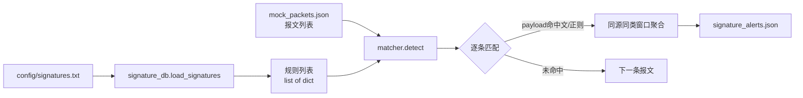

### 5.2 特征库管理子模块（signature_db.py）

**规则配置文件格式**（`config/signatures.txt`）：

```
# 格式: 规则ID | 攻击类型 | 匹配模式 | 特征串 | 适用协议 | 严重程度
SIG-001 | SQL注入 | literal | UNION SELECT | HTTP | high
SIG-002 | SQL注入 | literal | ' OR 1=1 | HTTP | high
SIG-003 | XSS | regex | <script.*?>.*?</script> | HTTP | medium
SIG-004 | 恶意命令 | literal | /bin/cat%20/etc/passwd | HTTP | high
SIG-005 | 木马通信 | literal | /faxsurvey? | TCP | high
```

**加载逻辑** `load_signatures(filepath)`：
- 按行读取，跳过空行和 `#` 开头的注释行
- 以 `|` 分隔符拆分为6个字段（`rule_id | category | match_mode | pattern | protocol | severity`）
- 字段数不等于6的行打印 WARNING 跳过，不中断加载
- 返回值：`list[dict]`，每条规则为包含上述6个键的字典

**匹配模式说明**：
- `literal`：大小写不敏感的 Python `str.lower() in` 子串匹配，性能 O(n·m)
- `regex`：使用 `re.search(pattern, payload, re.IGNORECASE)` 正则匹配，支持复杂模式

两者均可作为 baseline；高效多模式匹配（如 AC 自动机）是加分项，对比速度后写入报告。

### 5.3 匹配引擎子模块（matcher.py）

**`detect(packets, signatures=None)` 算法流程**：

```mermaid
flowchart TD
    START[输入报文列表 packets] --> LOAD_RULES{signatures<br/>参数传入?}
    LOAD_RULES -->|是| RULES[使用传入规则]
    LOAD_RULES -->|否| LOAD_FILE[从signatures.txt加载]
    
    RULES --> ITER[遍历每一条报文]
    LOAD_FILE --> ITER
    
    ITER --> HAS_PAYLOAD{payload<br/>非空?}
    HAS_PAYLOAD -->|否| NEXT_PKT[下一条报文]
    HAS_PAYLOAD -->|是| ITER_SIG[遍历每条规则]
    
    ITER_SIG --> PROTO_CHECK{协议匹配?<br/>sig.protocol==* 或<br/>pkt.protocol匹配}
    PROTO_CHECK -->|否| NEXT_SIG[下一条规则]
    PROTO_CHECK -->|是| MODE{match_mode?}
    
    MODE -->|literal| LITERAL[pattern.lower()<br/>in payload.lower()]
    MODE -->|regex| REGEX[re.search<br/>pattern, payload, IGNORECASE]
    
    LITERAL --> HIT{命中?}
    REGEX --> HIT
    
    HIT -->|是| BUILD_ALERT[构造告警记录<br/>detector=signature<br/>behavior_id=alert_id<br/>category=规则.attack_type<br/>severity=规则.severity]
    HIT -->|否| NEXT_SIG
    
    BUILD_ALERT --> NEXT_PKT
    
    NEXT_SIG -->|还有规则| ITER_SIG
    NEXT_SIG -->|规则遍历完| NEXT_PKT
    
    NEXT_PKT -->|还有报文| ITER
    NEXT_PKT -->|报文遍历完| AGGREGATE[同源同类窗口聚合]
    
    AGGREGATE --> OUTPUT[返回告警列表<br/>按timestamp排序]
```

**行为聚合规则**：
- 分组键：`(src_ip, category)`
- 窗口：默认60秒
- 同一分组内时间间隔 ≤ 窗口的同类型告警共享一个 `behavior_id`
- 作用：将逐包命中（如攻击者对同一登录页连续发送多条不同的SQL注入payload）合并为一个攻击行为事件，而非逐条报N个告警

**CLI入口**：
```bash
python -m src.signature_engine.matcher \
    --input mock_data/mock_packets.json \
    --output results/signature_alerts.json \
    --signatures config/signatures.txt  # 可选，默认使用配置文件
```

---

## 六、系统功能模块三：暴力破解检测模块（陈志恒）

### 6.1 模块结构

```
src/bruteforce_detect/
├── __init__.py
└── login_monitor.py  # 完整检测逻辑：_collect_attempts() → _max_count_in_window() → detect() → CLI
```

单文件内聚设计：所有辅助函数和检测逻辑集中在一个模块中，外部仅需调用 `detect(packets)`。

### 6.2 连接尝试收集（_collect_attempts）

```mermaid
flowchart TD
    PKTS[报文列表] --> ITER[遍历每条报文]
    ITER --> IS_DICT{isinstance<br/>pkt, dict?}
    IS_DICT -->|否| SKIP1[跳过]
    IS_DICT -->|是| IS_RST{flags含R<br/>且src_port<br/>为登录端口?}
    
    IS_RST -->|是| COUNT_RST[rejects计数+1<br/>记录RST拒绝佐证]
    IS_RST -->|否| CHK_PORT{dst_port<br/>∈ login_ports?}
    
    CHK_PORT -->|否| SKIP2[跳过]
    CHK_PORT -->|是| IS_RESP{direction<br/>==response?}
    
    IS_RESP -->|是| SKIP3[跳过响应报文]
    IS_RESP -->|否| IS_SYN{flags含S<br/>不含A?}
    
    IS_SYN -->|是| ADD_SYN[记录SYN时间戳<br/>attempts[key].syn.append]
    IS_SYN -->|否| FALLBACK[退化flow_id去重<br/>attempts[key].flows[id]=ts<br/>同连接只计一次]
    
    COUNT_RST --> ITER
    ADD_SYN --> ITER
    FALLBACK --> ITER
    SKIP1 --> ITER
    SKIP2 --> ITER
    SKIP3 --> ITER
```

**双模式计数策略**：
1. **优先SYN计数**：flags 含 "S" 且不含 "A" 的报文视为一次新建连接尝试。这是精确模式——一次 SYN = 一次 TCP 握手发起，直接对应一次登录尝试。
2. **退化flow_id去重**：当抓包环境中 flags 字段可能缺失时（如某些 TAP 设备不输出完整 TCP 头），退化为按不同 flow_id 计数，同一 flow_id 的多个数据包只计一次，防止重复计数。

**RST拒绝佐证**：
- 监测方向为受害目标→攻击源的 RST 报文（`flags` 含 "R"，`src_port` 为登录端口）
- 统计 `rejects[(attacker_ip, victim_ip, dst_port)]` 的值
- 该值在告警中作为"连接被拒绝次数"出现，证明认证失败（非连接超时或网络问题）

### 6.3 滑动窗口密度统计（_max_count_in_window）

```mermaid
flowchart LR
    subgraph 双指针滑动窗口算法
        EVENTS[已排序时间戳列表] --> INIT[left=0<br/>best_count=0]
        INIT --> LOOP[right从0到n-1]
        LOOP --> SHRINK{events[right]<br/>- events[left]<br/>> window_sec?}
        SHRINK -->|是| MOVE_LEFT[left++]
        MOVE_LEFT --> SHRINK
        SHRINK -->|否| UPDATE{right-left+1<br/>> best_count?}
        UPDATE -->|是| RECORD[best_count=count<br/>best_ts=events[right]]
        UPDATE -->|否| NEXT[right++]
        RECORD --> NEXT
        NEXT --> LOOP
    end
```

- 时间复杂度 O(n)，空间复杂度 O(1)
- 返回 `(窗口内最大事件数, 该窗口最后事件的时间戳)`
- 例如：18次SYN分布在36秒内（每条间隔2秒），60秒窗口可覆盖全部 → `best_count=18`

### 6.4 告警产出

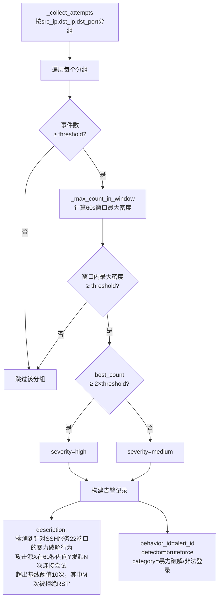

**严重度分档**：
- `medium`：窗口内连接尝试次数达到 threshold（默认10）
- `high`：窗口内连接尝试次数达到 2×threshold（默认20），表示高密度攻击

**告警描述（行为导向）**：
> "检测到针对 SSH 服务(22端口)的暴力破解行为，攻击源 192.168.1.99 在 60 秒内向 192.168.1.20 发起 18 次连接尝试，超出基线阈值 10 次，其中 18 次连接被目标拒绝(RST)，疑似认证失败"

**CLI入口**：
```bash
python -m src.bruteforce_detect.login_monitor \
    --input mock_data/mock_packets.json \
    --output results/bruteforce_alerts.json \
    --window 60 --threshold 10
```

---

## 七、系统功能模块四：异常行为检测模块（姜新晨）

### 7.1 模块结构与调用关系

```
src/anomaly_detect/
├── __init__.py
├── baseline.py              # 基线配置加载：load_config() + build_baseline()框架
└── anomaly_detector.py      # 检测引擎：端口扫描 + 异常外联 + CLI
```

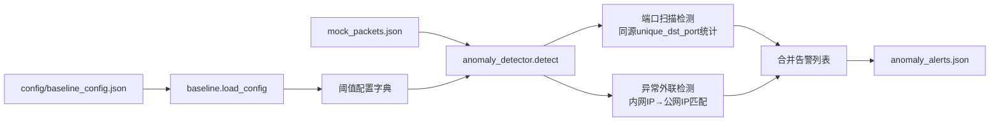

### 7.2 基线配置子模块（baseline.py）

**配置文件结构**（`config/baseline_config.json`）：

```json
{
  "port_scan": {
    "time_window_sec": 60,
    "unique_dst_port_threshold": 20,
    "description": "60秒内访问超过20个不同目标端口视为端口扫描"
  },
  "connection_rate": {
    "time_window_sec": 60,
    "max_connections_per_ip": 100
  },
  "external_connection": {
    "internal_networks": ["192.168.0.0/16", "10.0.0.0/8", "172.16.0.0/12"]
  },
  "lateral_movement": {
    "time_window_sec": 300,
    "internal_dst_count_threshold": 10
  },
  "session_duration": {
    "max_session_sec": 3600
  }
}
```

`load_config(config_path)` 函数读取 JSON 配置文件，文件不存在时返回空字典并使用代码中的默认值，不崩溃。

### 7.3 端口扫描检测

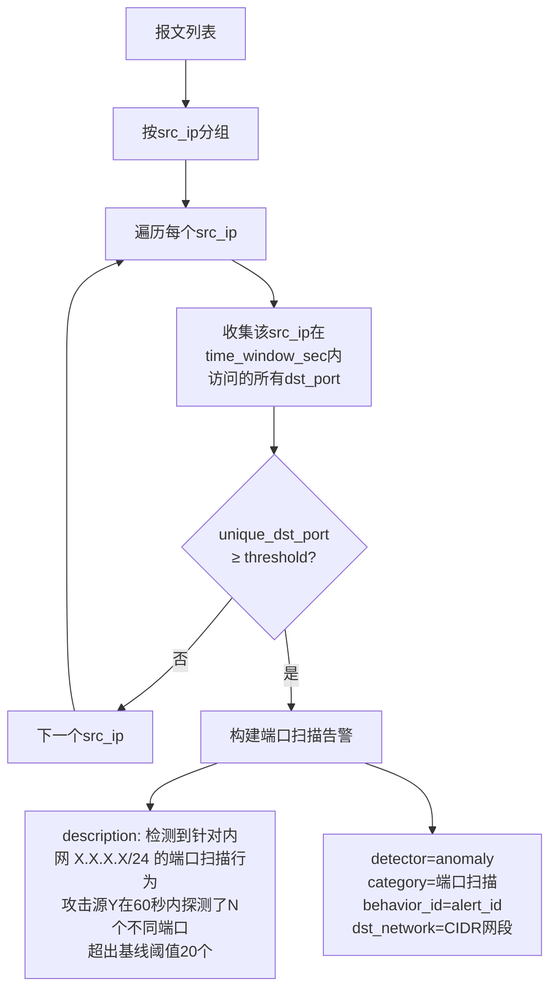

**检测逻辑**：
- 以 `src_ip` 为分组维度，统计在 `time_window_sec`（默认60秒）窗口内该 IP 访问过的不同 `dst_port` 集合
- 当 `len(unique_dst_ports) >= unique_dst_port_threshold`（默认20）时产生告警
- `dst_network` 字段填入被扫描的内网网段 CIDR 表示法，`dst_ip` 填入受扫描的代表性单个 IP

### 7.4 异常外联检测

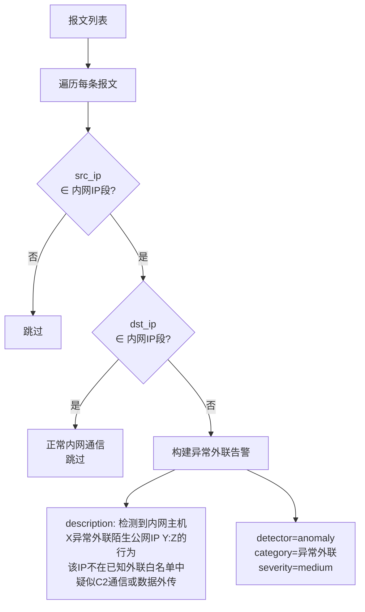

**检测逻辑**：
- 判断条件：`src_ip` 属于内网IP段（10.0.0.0/8、172.16.0.0/12、192.168.0.0/16）且 `dst_ip` 不属于上述任一内网段
- 满足条件的每个唯一（src_ip, dst_ip）对产生一条告警
- `severity` 设为 `medium`（需要进一步研判）

**CLI入口**：
```bash
python -m src.anomaly_detect.anomaly_detector \
    --input mock_data/mock_packets.json \
    --output results/anomaly_alerts.json \
    --config config/baseline_config.json  # 可选
```

---

## 八、系统功能模块五：告警汇总与监控GUI（韩宇飞）

### 8.1 模块结构

```
src/gui_alert/
├── __init__.py
├── aggregator.py     # 汇总 + 去重 + 行为关联 → merged_alerts.json
└── gui.py            # tkinter三页签GUI → 告警监控/特征库管理/统计概览
```

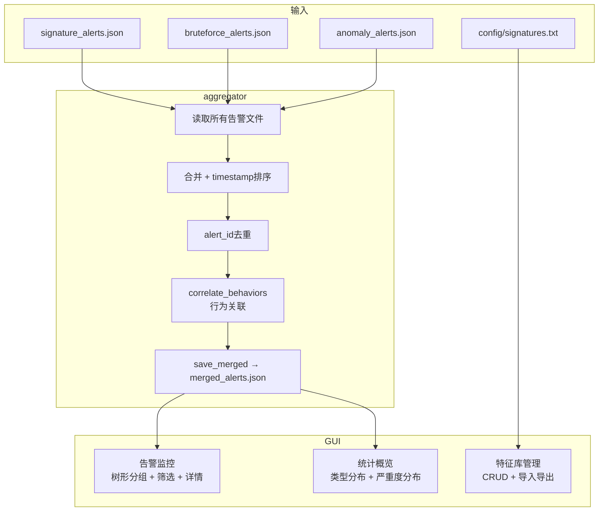

### 8.2 行为关联汇总子模块（aggregator.py）

**`aggregate(alert_files)` 处理流程**：

1. **加载**：遍历 `alert_files` 列表，逐个 JSON 反序列化，文件缺失/格式异常时打印 WARNING 跳过，不中断。
2. **合并排序**：将所有告警按 `timestamp` 升序排列。
3. **去重**：以 `alert_id` 为键去重，重复的 alert_id 仅保留首次出现者。
4. **行为关联**：调用 `correlate_behaviors(alerts, time_window_sec=60)`。

**`correlate_behaviors()` 算法**：

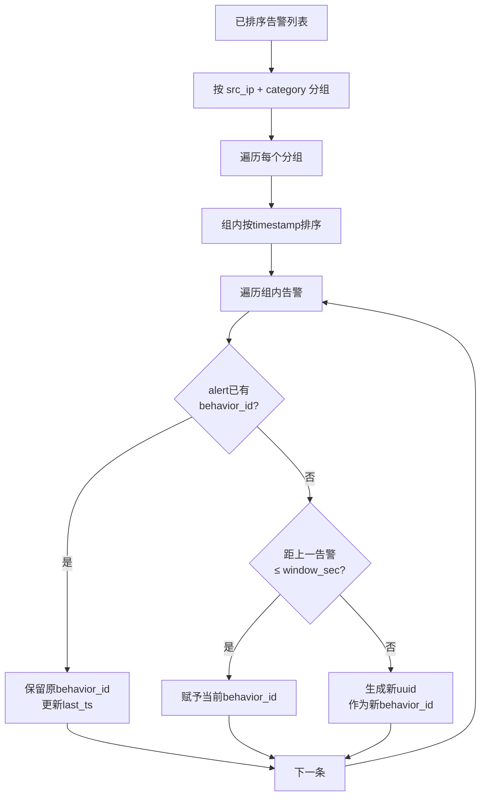

**关联规则**：
- 同一 `src_ip` + 同一 `category` + 时间间隔 ≤ 60秒 → 同一 `behavior_id`
- 检测模块已自行标注 `behavior_id` 的告警，aggregator 保留原值不覆盖
- 跨 detector 的同源同类告警也会被关联（例如 signature 和 anomaly 都检测到同一来源的攻击）

### 8.3 图形监控界面子模块（gui.py）

基于 tkinter + ttk 实现，零外部依赖。

**页签一「告警监控」**：

```mermaid
flowchart TB
    REFRESH[刷新按钮/30s自动刷新] --> LOAD[aggregate加载告警文件]
    LOAD --> FILTER[多条件筛选]
    
    subgraph 筛选栏
        DET[检测器下拉: 全部/signature/bruteforce/anomaly]
        SEV[严重度多选: high/medium/low]
        SEARCH[全文搜索输入框]
    end
    
    FILTER --> RENDER[渲染树形表格]
    
    subgraph 树形表格
        HEADER[▸ 行为 8f3a2c… | 暴力破解 | 192.168.1.99→192.168.1.20 | 共1条]
        ROW1[    8f3a2c… | bruteforce | 暴力破解 | high | 07-08 10:00:54]
    end
    
    RENDER --> SELECT[点击行]
    SELECT --> DETAIL[右侧JSON详情面板]
```

- 按 `behavior_id` 分组折叠展示，行为头行以灰色粗体标识
- 单条告警行按 severity 着色（high红/orange橙/low黄）
- 右侧详情面板以格式化JSON展示完整告警记录

**页签二「特征库管理」**：

```
工具栏: [➕新增] [✏️编辑] [🗑删除] [📥导入] [📤导出] [💾保存到文件]

表格:
┌─────────┬──────────┬──────────┬─────────────────┬────────┬──────┐
│ rule_id │ category │ match_mode│ pattern          │protocol│severity│
├─────────┼──────────┼──────────┼─────────────────┼────────┼──────┤
│ SIG-001 │ SQL注入   │ literal  │ UNION SELECT    │ HTTP   │ high  │
│ SIG-002 │ XSS      │ regex    │ <script.*?>...  │ HTTP   │ medium│
└─────────┴──────────┴──────────┴─────────────────┴────────┴──────┘
```

- 新增/编辑：弹出 Toplevel 表单，6字段输入，确认后更新内存中的规则列表
- 删除：确认弹窗后从列表移除
- 导入：文件选择对话框读取外部 .txt 文件
- 导出/保存：将当前规则列表按6字段格式写回文件（`|` 分隔）

**页签三「统计概览」**：

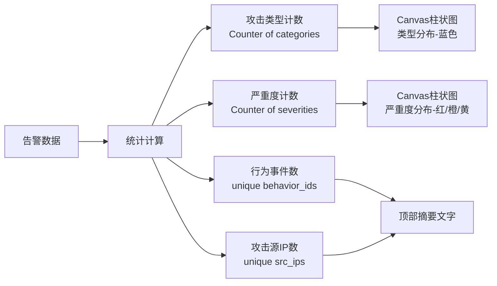

- Canvas 自绘柱状图，无需 matplotlib 等额外依赖
- 颜色统一：high=#dc3545红、medium=#fd7e14橙、low=#ffc107黄、图表柱=#4e73df蓝
- 随数据变化自动缩放柱状图比例

**启动方式**：

```bash
# 方式一：全链路运行（检测+汇总+GUI）
python main.py --input mock_data/mock_packets.json

# 方式二：仅启动GUI（读取已有告警文件）
python main.py --gui-only

# 方式三：独立CLI运行各检测模块后手动汇总
python -m src.gui_alert.aggregator  # 汇总results/下已有告警
```

---

## 九、接口设计

所有模块通过两个标准化 JSON Schema 通信。详细规范见 `docs/interface_spec.md`。

### 9.1 报文记录格式（Packet Record）

由 capture 模块（李哲）产出，三个检测模块（曾子恒/陈志恒/姜新晨）统一消费。

```json
{
  "timestamp": "2026-07-08T10:00:00.123",
  "flow_id": "192.168.1.10:51234->192.168.1.20:80/TCP",
  "src_ip": "192.168.1.10",
  "src_port": 51234,
  "dst_ip": "192.168.1.20",
  "dst_port": 80,
  "protocol": "TCP",
  "direction": "request",
  "flags": "PA",
  "payload": "GET /login.php?id=1 UNION SELECT username,password FROM users-- HTTP/1.1",
  "payload_len": 128
}
```

| 字段 | 类型 | 必填 | 说明 |
|---|---|---|---|
| `timestamp` | string(ISO8601) | 是 | 精确到毫秒，如 `2026-07-08T10:00:00.123` |
| `flow_id` | string | 否 | 五元组流标识，格式 `src_ip:src_port->dst_ip:dst_port/protocol` |
| `src_ip` | string | 是 | 源IP地址 |
| `src_port` | int | 否 | 源端口，ICMP/ARP 等无端口协议为 null |
| `dst_ip` | string | 是 | 目的IP地址 |
| `dst_port` | int | 否 | 目的端口 |
| `protocol` | string | 是 | TCP / UDP / ICMP / ARP |
| `direction` | string | 否 | request / response，无法判断时可为 null |
| `flags` | string | 否 | TCP标志位组合：S(SYN) A(ACK) P(PSH) F(FIN) R(RST) |
| `payload` | string | 否 | 应用层载荷，二进制用 `\xNN` 转义 |
| `payload_len` | int | 是 | 线路上原始 payload 字节长度 |

### 9.2 统一告警格式（Alert Record）

由三个检测模块产出，aggregator（韩宇飞）消费。

```json
{
  "alert_id": "b3f1a2c4-1234-4abc-9def-000000000001",
  "behavior_id": "b3f1a2c4-1234-4abc-9def-000000000001",
  "detector": "signature",
  "category": "Web攻击/SQL注入",
  "src_ip": "192.168.1.10",
  "src_port": 51234,
  "dst_ip": "192.168.1.20",
  "dst_network": null,
  "dst_port": 80,
  "severity": "high",
  "description": "检测到针对 /login.php 的 SQL 注入攻击行为，攻击者尝试利用 UNION 查询提取数据库用户凭据",
  "evidence": "GET /login.php?id=1 UNION SELECT username,password FROM users--",
  "timestamp": "2026-07-08T10:00:01.000"
}
```

| 字段 | 类型 | 必填 | 说明 |
|---|---|---|---|
| `alert_id` | string(uuid) | 是 | 全局唯一告警ID，`uuid.uuid4()` 生成 |
| `behavior_id` | string(uuid) | 否 | 攻击行为事件标识，检测模块填入（=alert_id）或由 aggregator 自动关联赋值 |
| `detector` | string | 是 | signature / bruteforce / anomaly |
| `category` | string | 是 | 攻击类型简述，如"暴力破解/非法登录"、"端口扫描"、"内网横向扩散" |
| `src_ip` | string | 是 | 攻击源IP |
| `src_port` | int | 否 | 攻击源端口，暴力破解/扫描场景下为 null |
| `dst_ip` | string | 是 | 受害目标IP，网段级告警时可填代表性单IP或 "multiple" |
| `dst_network` | string | 否 | CIDR网段（如 `192.168.1.0/24`），端口扫描/横向扩散时填写 |
| `dst_port` | int | 否 | 受害目标端口 |
| `severity` | string | 是 | low / medium / high |
| `description` | string | 是 | **攻击行为描述**：须描述攻击者行为（如"针对SSH服务的暴力破解行为"），非特征罗列 |
| `evidence` | string | 否 | 匹配原始内容或统计证据（如 `attempt_count=18, threshold=10`） |
| `timestamp` | string(ISO8601) | 是 | 告警产生时间 |

### 9.3 统一函数签名

所有检测模块必须遵循同一函数签名：

```python
def detect(packets: list[dict]) -> list[dict]:
    """
    Args:
        packets: 符合 9.1 报文记录格式的列表
    Returns:
        符合 9.2 统一告警格式的列表（无告警时返回空列表 []，不返回 None）
    """
```

### 9.4 统一日志规范

所有模块使用 Python 标准库 `logging`：

```python
import logging
logger = logging.getLogger(__name__)

logging.basicConfig(
    level=logging.INFO,
    format="[%(name)s] %(levelname)s %(asctime)s %(message)s",
)
```

- `logger.debug()` — 调试信息（如跳过单条报文的原因）
- `logger.info()` — 正常流程信息（如"已加载N条规则""扫描完成，产生M条告警"）
- `logger.warning()` — 非致命异常（文件缺失、字段缺失、格式不合法）
- `logger.error()` — 致命错误（scapy未安装）
- **禁止使用 `print()` 调试**（CLI结束时的摘要除外）

---

## 十、开发平台

### 10.1 软件平台

| 项目 | 选型 | 版本要求 | 说明 |
|---|---|---|---|
| 开发语言 | Python | ≥ 3.9 | 不使用 3.10+ 独有语法（如 match/case），保持向下兼容 |
| 抓包库 | scapy | ≥ 2.5.0 | 实时抓包(嗅探) + pcap/pcapng 离线读取 |
| GUI框架 | tkinter | Python标准库 | ttk 主题化组件，零依赖，任何Python环境可直接运行 |
| 测试框架 | pytest | ≥ 7.0 | fixture机制复用mock数据，简洁断言 |
| 版本控制 | Git | — | GitHub Flow：feature分支开发 → PR → Code Review → 合并main |
| 代码格式化 | black + isort | ≥ 24.0 / ≥ 5.13 | 推荐安装，非强制；统一代码风格减少冲突 |

### 10.2 硬件平台

- **最低配置**：双核CPU、4GB内存、10GB可用磁盘空间
- **推荐配置**：四核CPU、8GB内存、SSD硬盘
- **网络**：实时抓包需网卡支持混杂模式（Promiscuous Mode）
- **虚拟化**：VirtualBox / VMware / WSL2 均可；虚拟机网络建议桥接模式
- **操作系统**：Linux（推荐 Ubuntu 22.04 LTS）或 Windows 10/11 + WSL2；macOS 兼容但未测试

---

## 十一、系统出错处理

```mermaid
flowchart TD
    ERR[异常发生] --> TYPE{异常类型}
    
    TYPE -->|文件不存在/为空| W1[打印WARNING日志<br/>返回空结果<br/>不抛异常]
    TYPE -->|非必填字段缺失| W2[按null处理<br/>跳过依赖该字段的判断<br/>不中断流程]
    TYPE -->|payload含二进制| W3[\xNN转义<br/>保留可读ASCII<br/>不影响其余字段]
    TYPE -->|数据量不足<br/>统计窗口| W4[不产生告警<br/>不报错]
    TYPE -->|flow_id缺失| W5[消费模块自行<br/>根据五元组构建]
    TYPE -->|scapy未安装| E1[打印ERROR日志<br/>返回空列表]
    TYPE -->|时间戳无法解析| W6[跳过该报文<br/>其余报文正常处理]
    TYPE -->|JSON格式异常| W7[打印WARNING<br/>跳过该文件<br/>不中断汇总]
    TYPE -->|规则行格式不合法| W8[跳过该行<br/>打印WARNING<br/>继续加载其余规则]
```

| 异常场景 | 处理策略 | 影响范围 |
|---|---|---|
| 输入文件不存在 / 为空 | 打印 WARNING 日志，返回空列表 `[]`，不崩溃 | 单模块 |
| 报文记录缺失非必填字段 | 按 `null` 处理，跳过依赖该字段的判断逻辑 | 单条报文 |
| payload 含无法解码的二进制内容 | `\xNN` 转义保留，不影响其余字段解析 | 无 |
| 数据量不足以形成统计窗口 | 不产生告警，不报错 | 无 |
| flow_id 缺失 | 消费模块自行根据五元组 `{src_ip}:{src_port}->{dst_ip}:{dst_port}` 构建 | 单模块内部 |
| scapy 未安装（实时抓包场景） | 打印 ERROR 日志，`capture_live()` 返回空列表 | capture模块 |
| 时间戳无法解析 | 跳过该报文的时间判断，其余报文正常处理 | 单条报文 |
| JSON 文件格式异常 | 打印 WARNING/ERROR 日志，跳过该文件，不中断汇总流程 | 单文件 |
| GUI 无告警数据可展示 | 状态栏显示"未找到告警文件"，不弹错误对话框 | GUI |
| 特征库规则行格式不合法（字段数≠6） | 跳过该行，打印 WARNING，继续加载其余规则 | 单条规则 |
| 实时抓包权限不足 | 打印 ERROR 日志并提示需 root/管理员权限 | capture模块 |
| 检测模块未产生告警 | 输出空 JSON 数组 `[]` 而非缺失文件，aggregator 合并时平滑处理 | 无 |

---

> **文档编写**：韩宇飞（组长）
> **审核**：全体成员
> **日期**：2026年7月17日
